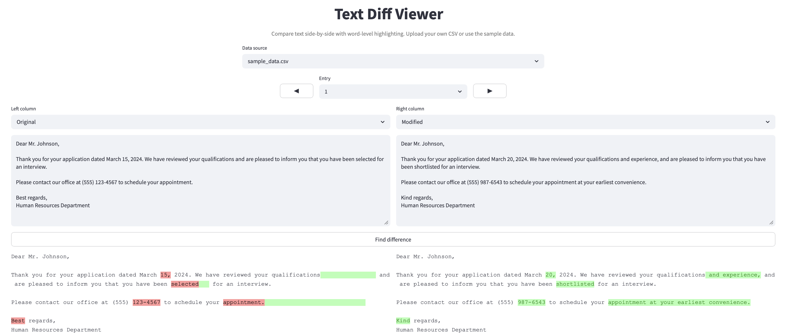

# Text Diff Viewer

A Streamlit app for comparing text side-by-side with word-level difference highlighting.



## Features

- **Word-level diffing** with color-coded highlights (green for additions, red for deletions) and length-balanced padding to visualize the size of changes
- **Free text mode** for quick comparisons
- **CSV mode** for browsing and comparing columns across rows, with arrow navigation

## Getting Started

```bash
pip install -r requirements.txt
streamlit run app.py
```

## CSV Format

Place CSV files in the `data/` directory. The app auto-detects them in the data source dropdown. Configure the CSV separator in the sidebar (default: `;`).

## Use Case: Reviewing Anonymized Data

This tool is handy for visually inspecting text before and after anonymization. Pair it with an anonymization tool like [Presidio](https://github.com/microsoft/presidio) or [text-anonymizer](https://github.com/BleTib/text-anonymizer) to spot-check results.